# Business Intelligence and Customer Prediction System

### This is the largest model and preprocessing data project I have ever done and the best deploying without any helping from AI

## So I will explain it clearly below
- Data 
- Model 
- EDA
- Fine Tuning
- Final Model
- Targets From The Model
- HTML & CSS code
- JavaScript & FAST API % HuggingFace

--- 

# Fast Overview Before Details

### Features

- Predicts whether a customer will churn or stay
- Predicts what phone offer level the customer needs (Budget, No Offer, Premium, Retention)
- Built on 100 features merged from two datasets (Record.csv and Client.csv)
- Trained and compared three models: XGBoost, Random Forest, and CatBoost
- Best performance achieved with XGBoost
- Full EDA pipeline including correlation matrix, feature importance, and NaN handling
- Fine-tuned hyperparameters for the best result
- Connected to a live API hosted on Hugging Face
- Simple HTML and CSS form with two prediction buttons

### Tech Stack

- Machine Learning : Python , Xgboost, Random Forest, CatBoost, Scikit-Learn, Pandas

- Backend: FastAPI , Joblib

- Fronend: HTML, CSS, JS

- API Hosted: HuggingFace

### Installation

- To run project
- 1) colone the repo
- 2) install required libraries

# Details

### Data 
- Record.csv & Client.csv
- This Data is about client you should use it to improve the bussiness of the company 
- This Data has 100 feature when we marge the two files according to ID and if you want to know each feature endicate to what read this PDF "ENG_Company _A_ Dataset Overview.docx.pdf"
---
### EDA
- 1 Delete the data which has high correlation to avoid overfitting and misunderstanding for the model 
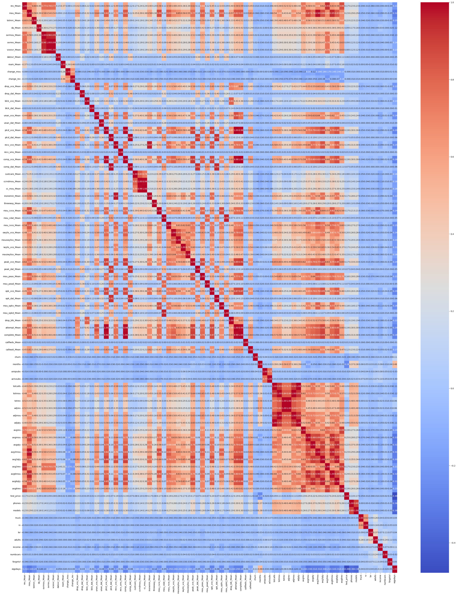
---
- 2 Using initial model to choose the most important features 
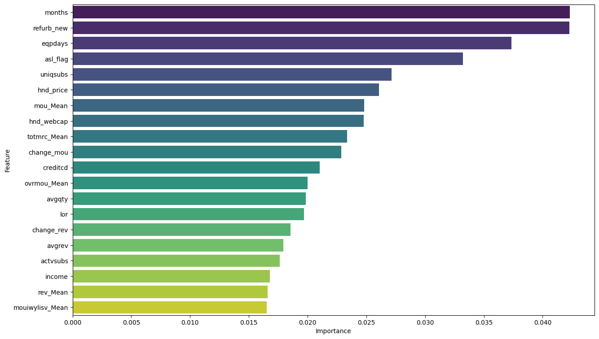
---
- 3 Delete Features has many nan values
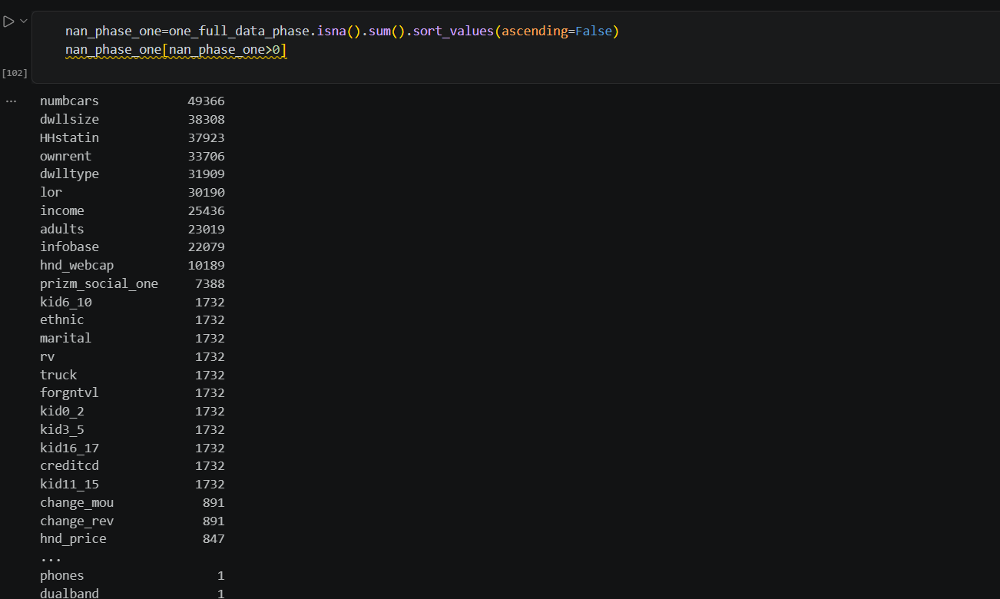

---

- 4 Do many graphs and you can see all these steps clearer in this file * gci_final_advanced.ipynb * and these are examples graphs

---
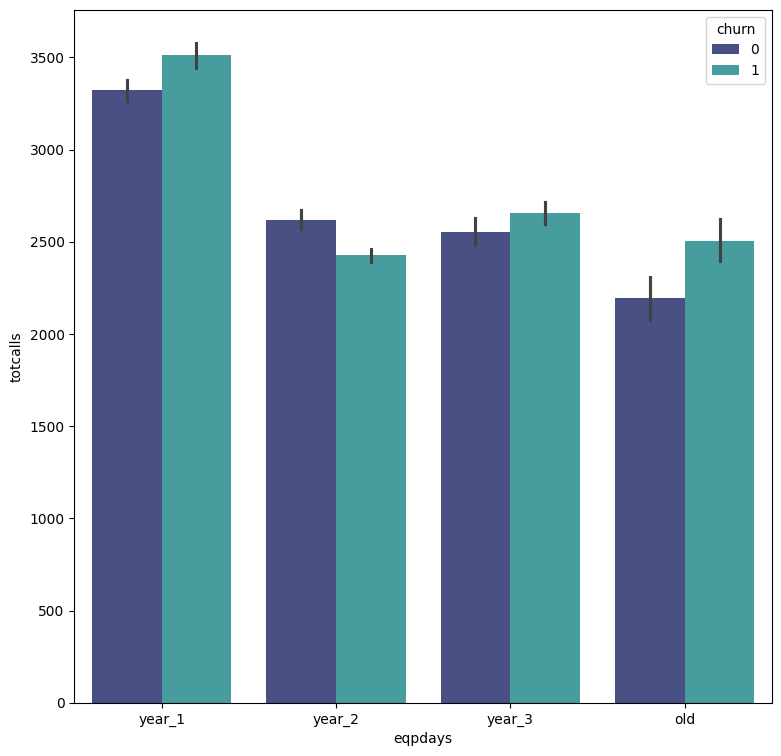
---
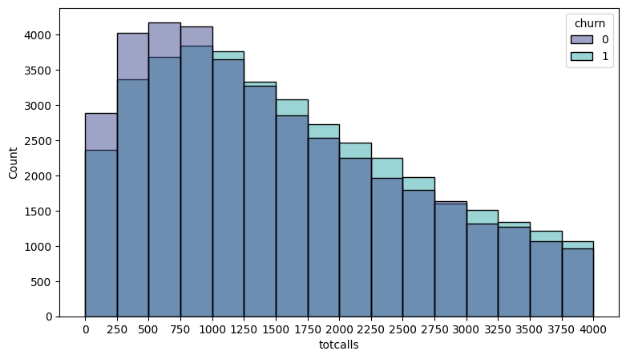
---

---
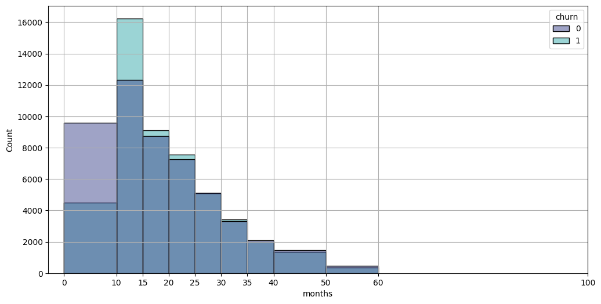

---

### Fine Tuning & Model

- I have used the final data to find the best hyperparameters for the model and I have tried 3 models 
- First model XGBoost
- Second Random Forest
- Third CatBoost
- Then I did the best model of each one and save all models by extention ".pkl"
- And the best pereformance was from the XGBoost

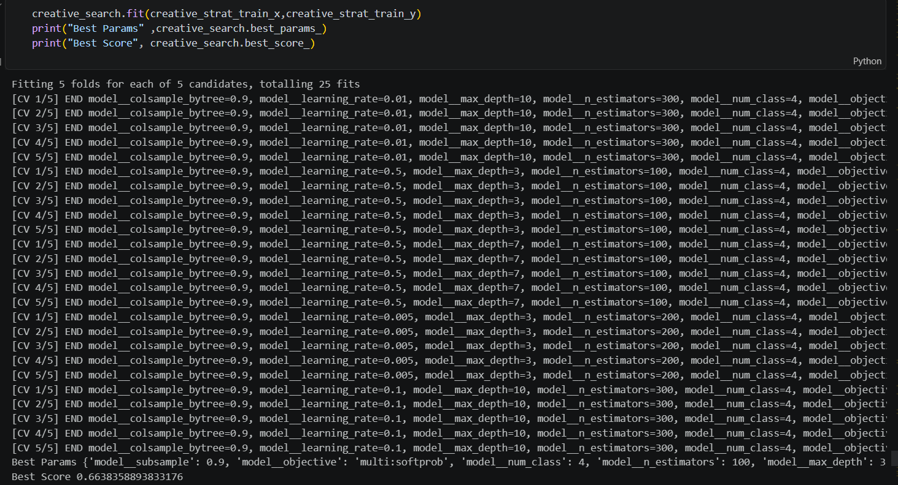
---

### Final Model Training

- Marketing target (creative target) 
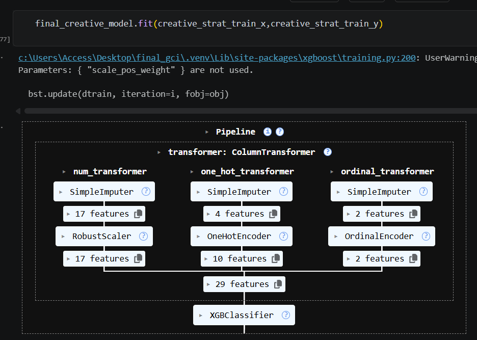
---

- Churn Target Model
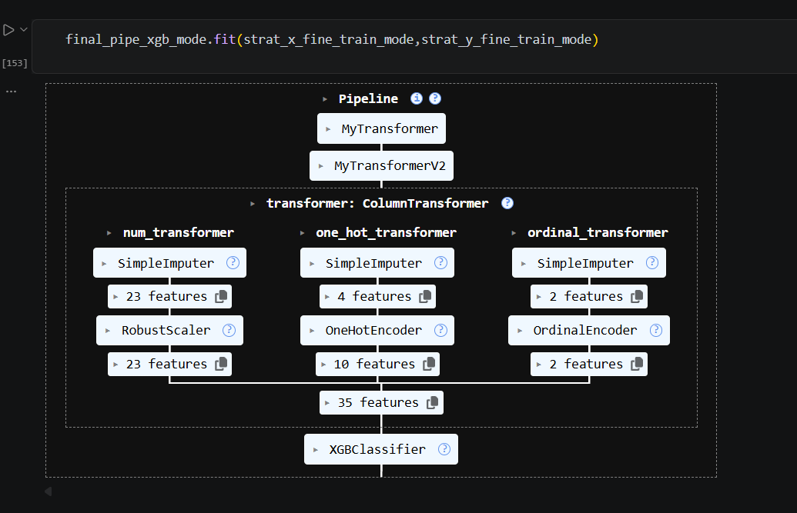
---

### Target From The Model

- First target is churn if the customer stay or close to leave
- Second Model or target when i did the data analysit of the data i find out the customers leave because thier phones be old so i did model to tell me if the customer need phone and in which level
- there are 4 levels 
- Budget (cost-saving offers)
- No Offer (No intervention needed)
- Premium (Upgrades)
- Retention (High-Priority Resolution)

---

### HTML & CSS 

- After about 25 hrs of work I have make a form by HTML & CSS by simple design 

- Make A form with 2 buttons to detect

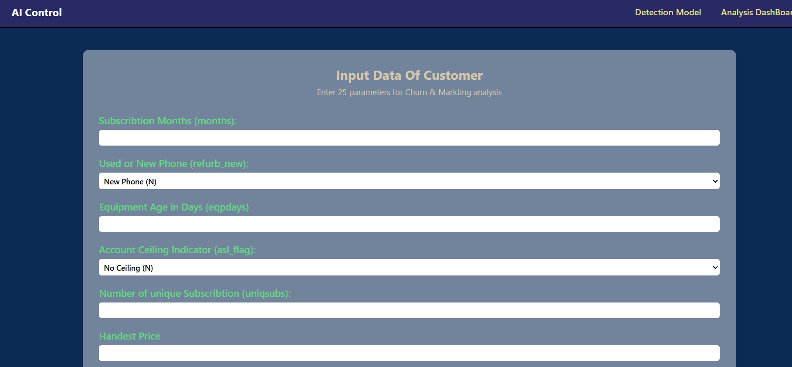

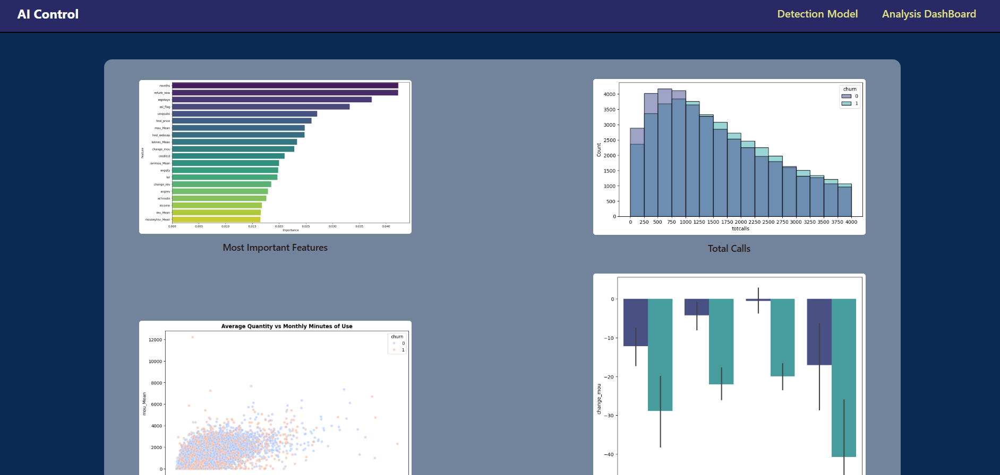
---

### Js & FASTAPI & HuggingFace

- I have used FASTAPI to make API connect the model
- I have Used js to connect this API by the form and the form by the model
- I have used HuggingFace to make my API on Online server not local

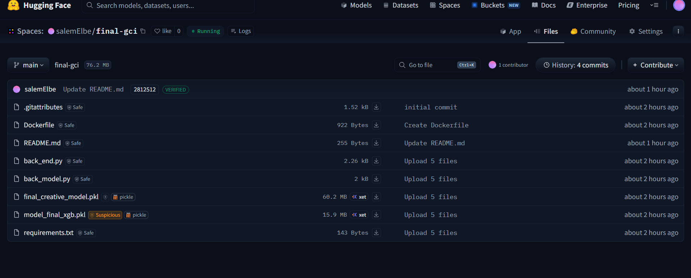
